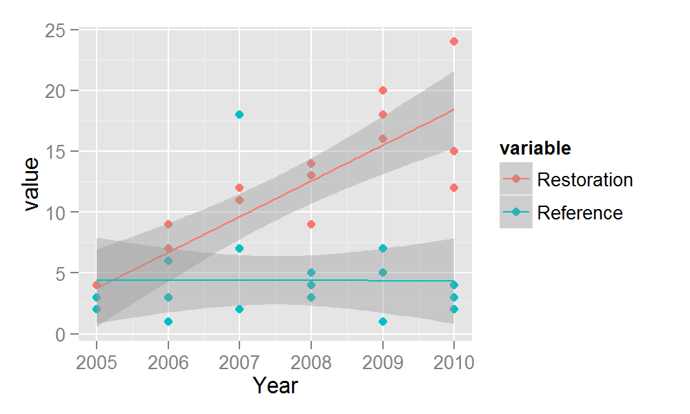

======================
Here's a report I made for my_data
----------------------

### Model summary
<!-- html table generated in R 3.0.3 by xtable 1.7-3 package -->
<!-- Thu May 22 17:26:48 2014 -->
<TABLE border=1>
<TR> <TH>  </TH> <TH> Estimate </TH> <TH> Std. Error </TH> <TH> t value </TH> <TH> Pr(&gt;|t|) </TH>  </TR>
  <TR> <TD align="right"> (Intercept) </TD> <TD align="right"> -2923.66 </TD> <TD align="right"> 893.01 </TD> <TD align="right"> -3.27 </TD> <TD align="right"> 0.00 </TD> </TR>
  <TR> <TD align="right"> variableReference </TD> <TD align="right"> -6.72 </TD> <TD align="right"> 1.52 </TD> <TD align="right"> -4.42 </TD> <TD align="right"> 0.00 </TD> </TR>
  <TR> <TD align="right"> Year </TD> <TD align="right"> 1.46 </TD> <TD align="right"> 0.44 </TD> <TD align="right"> 3.29 </TD> <TD align="right"> 0.00 </TD> </TR>
   </TABLE>

### Figure of restoration and reference by year
 

